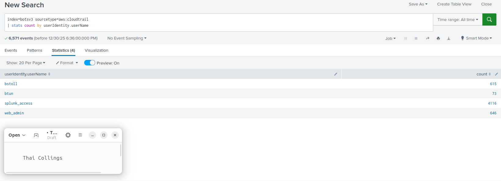
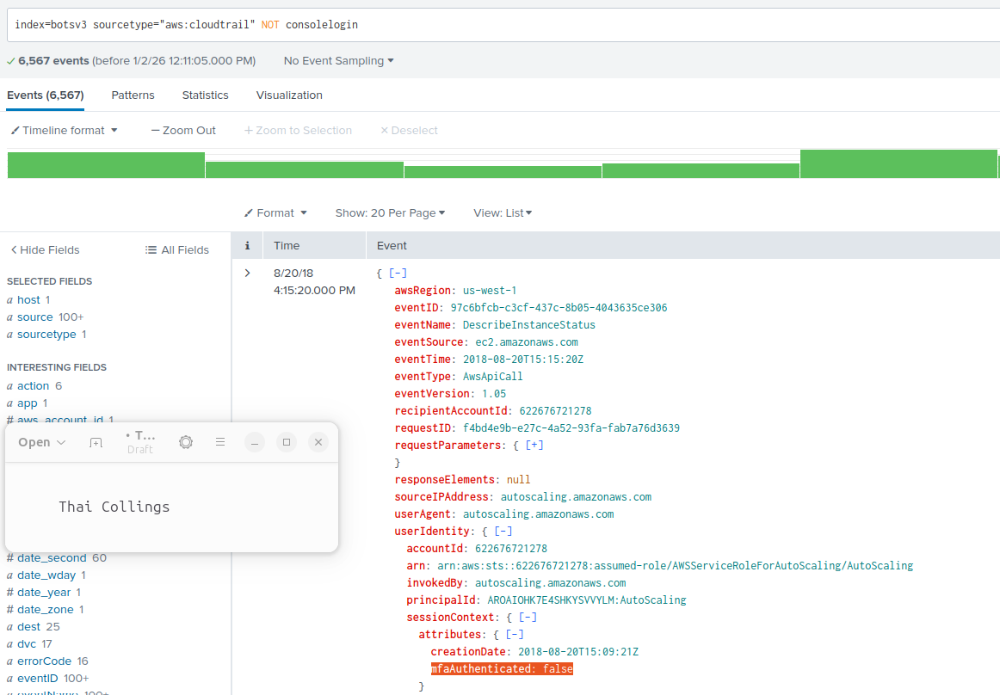
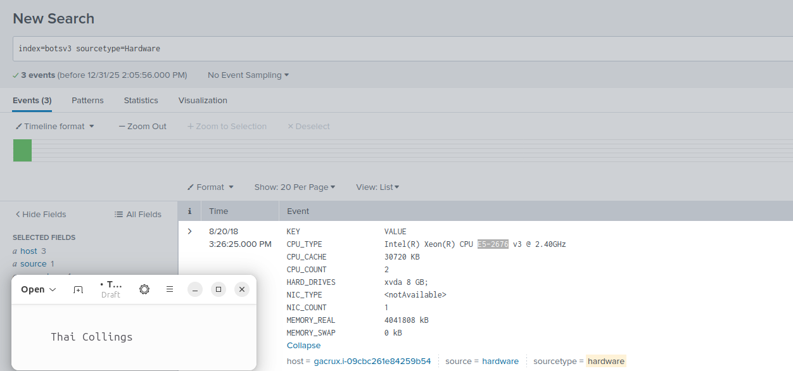
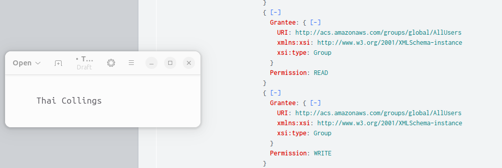
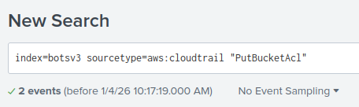
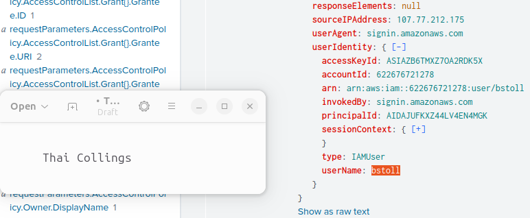
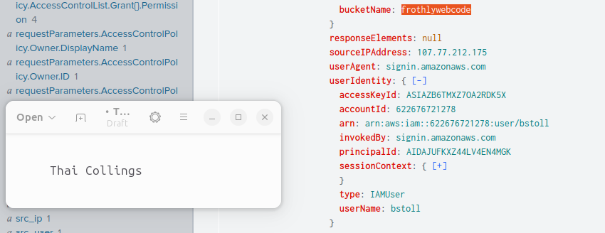
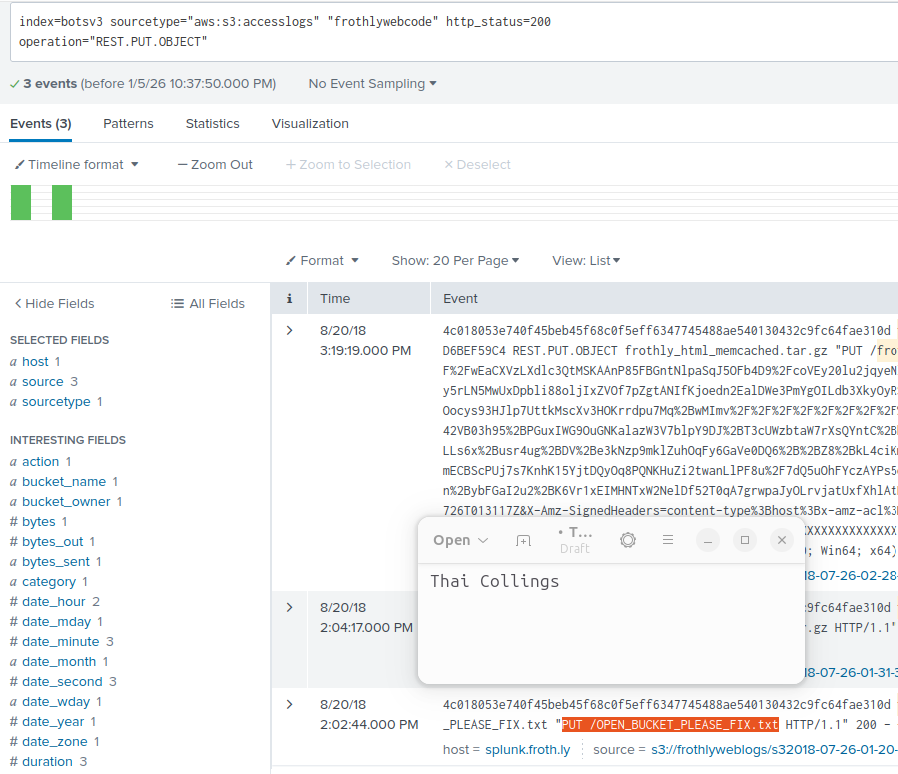
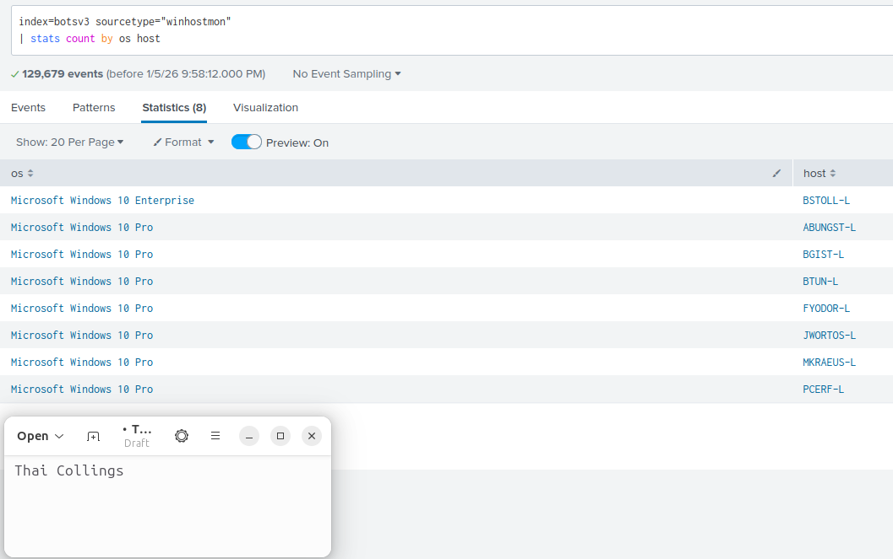

# COMP3010-BOTSv3

## Table of contents
1. [Introduction](#introduction)
2. [Installation and data preparation](#installation-and-data-preparation)
3. [Question 1](#question-1)
4. [Question 2](#question-2)
5. [Question 3](#question-3)
6. [Question 4](#question-4)
7. [Question 5](#question-5)
8. [Question 6](#question-6)
9. [Question 7](#question-7)
10. [Question 8](#question-8)

## Introduction
In this report i analyse secuirty incidents using the BOTSv3 dataset. The goal of this report is to show how an SOC (Security Operations Centre) can use tools such as splunk to detect, analyse and respond to incidents in an effective and timely manner. These indicents include examples of compromised IAM users, misconfigurations and API activity. The SOC plays a vital role in identifying incidents such as the ones found in the BotsV3 dataset. This report will highlight the following SOC responsibilities and handling methodlogies will be highlighted in this report.
  - **Prevention**: Measures to avoid incidents such as securing aws credentials or configuring proper access control for S3 Buckets.
  - **Detection**: Identifying and alerting of suspicious activity.
  - **Response**: How incidents are investigated and mitigated, such as analysing logs and isolating compromised systems.
  - **Recovery**: Completing steps during the recovery phase, restoring access and stregthening security protocols.

## Installation and data preparation
Initially, Splunk was installed onto a ubuntu virtual machine to analyse the BOTSv3 dataset. Here is the installation process:
  1. Download VMWare and installed a suitible Ububntu ISO
  2. Next, Splunk was installed on Ubuntu, downloading from the official Spunk website
  3. Downloaded the BOTSv3 dataset from the official GitHub repository (https://github.com/splunk/botsv3)
  4. Followed instructions to injest data and installed all relevent and required apps.

## Question 1 
List out the IAM users that accessed an AWS service (successfully or unsuccessfully) in Frothly's AWS environment?

**Objective:**
The goal of this query is to identify the IAM users who have accessed the AWS services using the AWS CloudTrail logs.

**Method:**
AWS CloudTrail logs were analysed using Splunk queries to identify usernames with AWS API activity.

**Query:**
```spl
index=botsv3 sourcetype=aws:cloudtrail
| stats count by userIdentity.userName
```
<p align="center">
  
</p>

**Findings:**
The results show multiple IAM users accessing AWS services, identified by the ```sple userIdentity.userName``` field which records the IAM username associated with each event. Revealing the usernames: **bstoll, btun, splunk_access, web_admin.**

**SOC Relevance:**
Identifying IAM user users that access AWS services is a fundimental core for SOCs. This information ensures accountability, aids with anomoly detection and helps to identify potentially compromised or misused user credentials.

## Question 2
What field would you use to alert that AWS API activity has occurred without MFA?

**Objective:**
The goal of this query is to determine the CloudTrail field that can used to alert the SOC of AWS API activity occuring **without MFA**, excluding console logins. 

**Method:**
In Splunk the source type was set to CloudTrail. This allowed me to look at any logs for MFA related fields. To enhance my search i excluded console login events. Ensuring that i found exactly what i was looking for. When set to false the SOC will know that the login was attempted without MFA.

**Query:**
```spl
index=botsv3 sourcetype=aws:cloudtrail NOT consolelogin
```
<p align="center">
  
</p>

**Findings:**
The results show that the MFA logs are kept in the **userIdentity.sessionContext.attributes.mfaAuthenticated** field. Event logs, where this field is set to **No** or **False** indicates AWS was accessed without the use of MFA.

**SOC Relevance:**
AWS API use without MFA is a **high risk security condition.** This should be prevented wherever possible. This useful tool built into Splunk allows the SOC to, trigger an alert when unsecure usage is happening, detect potentially stolen credentials and enforce security best practices. 

## Question 3
What is the processor number used on the web servers? 

**Objective:**
The goal of this query is to determine hardware, specifically the model of CPU used by the web server.

**Method:**
In Splunk the source type was set to Hardware. Revealing 3 logs that all shared the same CPU: **E5-2676.**

**Query:**
```spl
index=botsv3 sourcetype=Hardware
```
<p align="center">
  
</p>

**Findings:**
The results show that the web servers use an Intel **E5-2627** CPU. 

**SOC Relevance:**
Understantding server hardware allows an SOC to: understand the impact of performance related attacks such as DoS attacks and make informed recovery descisions after such attacks.

## Question 4
Bud accidentally makes an S3 bucket publicly accessible. What is the event ID of the API call that enabled public access?

**Objective:**
The goal of this query is to identify the event in which the S3 bucket was made accessible and availible to all users

**Method:**
AWS CloudTrail logs were analysed, searching for PutBucketAcl along side.

**Query:**
```spl
index=botsv3 sourcetype=aws:cloudtrail "PutBucketAcl."
```
<p align="center">
  
</p>

<p align="center">
  
</p>

**Findings:**
The results show that the S3 bucket was made publically availible in the event **ab45689d-69cd-41e7-8705-5350402cf7ac**

**SOC Relevance:**
Identifying the event that caused the vulnerability will allow the SOC to answer what changed, when did it happened and who did it. This provides vital context to the SOC allowing them to plan and tackle the vulnerability quickly and efficiently. 

## Question 5
What is Bud's username?

**Objective:**
The goal of this query is to identify the username of Bud

**Method:**
AWS CloudTrail logs were analysed, searching for PutBucketAcl along side.

**Query:**
```spl
index=botsv3 sourcetype=aws:cloudtrail "PutBucketAcl."
```
<p align="center">
  
</p>

**Findings:**
The results show that Bud's username is **BStoll**

**SOC Relevance:**
In this context identifying buds username in the event log gives them further context into who made the S3 bucket public. This will allow them to investigate whether this was human error or an outside attack.

## Question 6
What is the name of the S3 bucket that was made publicly accessible?

**Objective:**
The goal of this query is to identify the S3 bucket that was made public to Bud.

**Method:**
AWS CloudTrail logs were analysed, searching for PutBucketAcl along side. Looking for the name is the bucket.

**Query:**
```spl
index=botsv3 sourcetype=aws:cloudtrail "PutBucketAcl."
```
<p align="center">
  

**Findings:**
The results show that the name is the bucket is **frothlywebcode** as seen in the screenshot above.

**SOC Relevance:**
Identifying the bucket that was made public by Bud provides more context for the SOC. Furthermore allowing them understand the severity of the situation, low, meduim or high. This also allows them to quickly contain the situation, making the bucket private again quickly and preventing any uneccessary outages.

## Question 7
What is the name of the text file that was successfully uploaded into the S3 bucket while it was publicly accessible?

**Objective:**
The goal of this query is to identify the file that was successfully uploaded to the S3 bucket while it was public.

**Method:**
AWS CloudTrail logs were analysed, using the source type "aws:s3:accesslogs", then i searched for the keyword "frothlywebcode" becuase that is the name of the S3 bucket. However, this returned many events, looking through these manually would simply have taken too long. Understanding that it was a successful upload i decided to search for HTTP status 200 codes (**OK**) and **PUT** operations. This narrowed down the results.

**Query:**
```spl
index=botsv3 sourcetype="aws:s3:accesslogs" "frothlywebcode" http_status=200
operation="REST.PUT.OBJECT"
```
<p align="center">
  
</p>

**Findings:**
The results show that the file **"OPEN_BUCKET_PLEASE_FIX.TXT"** was uploaded to the S3 bucket while it was public

**SOC Relevance:**
Identifying that files that have been uploaded to the public bucket suggests more than a misconfiguration and will allow the SOC to gain a better understanding of what happnened and the steps that must be taken to contain and remove the threat with minimal interruption 

## Question 8
What is the FQDN of the endpoint that is running a different Windows operating system edition than the others?

**Objective:**
The objective of this tasks is to fing the FQDN (Fully qualified domain name) of the host that is using a differing operating system to the others.

**Method:**
Multiple queries are used to find this information. First, setting the source type to **WinHostMon**, which gathers information and statistics about the hosts and filtering for the OS of each corresponding host revieled one outlier. BSTOLL-L was using windows 10 enterprise vs windows 10 professional. So, by looking for the "**Computer**" name of the host **BSTOLL-L** the FQDN can be found.
**Query:**
```spl
index=botsv3 sourcetype="WinHostMon"
| stats count by os host
```
```spl
index=botsv3 host="BSTOLL-L" "computer-name"
```
<p align="center">
  
  
  
</p>

**Findings:**
**BSTOLL-L.froth.ly** is the FQDN of the host that is using a different version of windows to all of the other hosts

**SOC Relevance:**
Identifying the outlier host give the SOC a point to start their investigation because the anomoly could suggest potentially higher risk. Furthermore, it could be a misconfiguration meaning a potentially increased security risk. Potetntially missing security groups and or policies. This SOC can also ask, did this host access the public bucket? upload or download files? Or generate any suspicious traffic?
